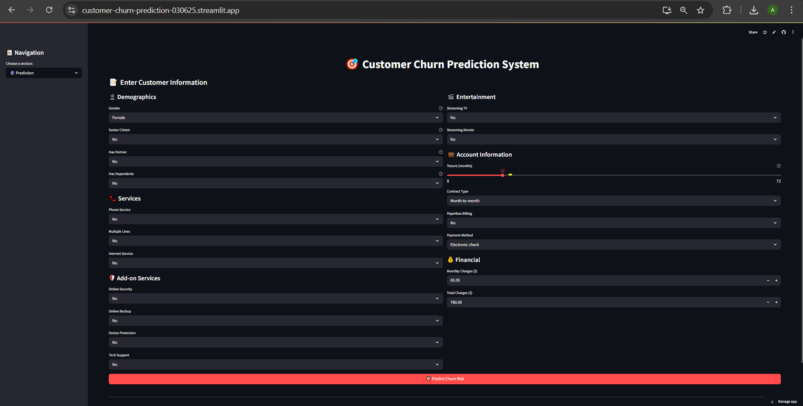
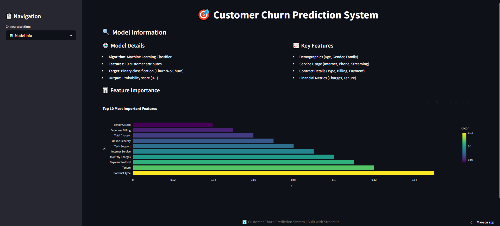
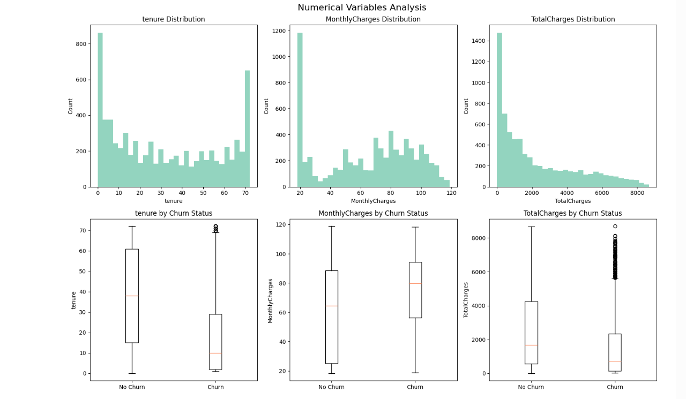
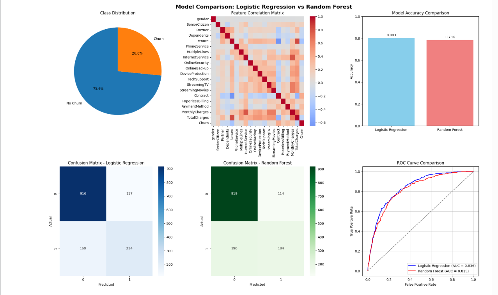
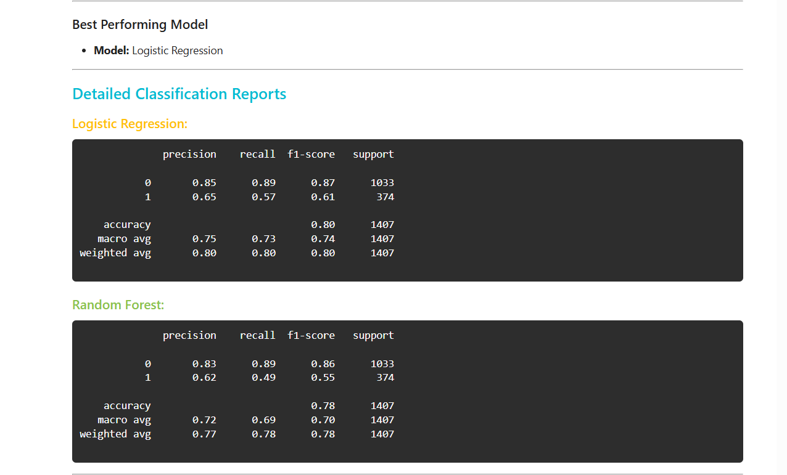
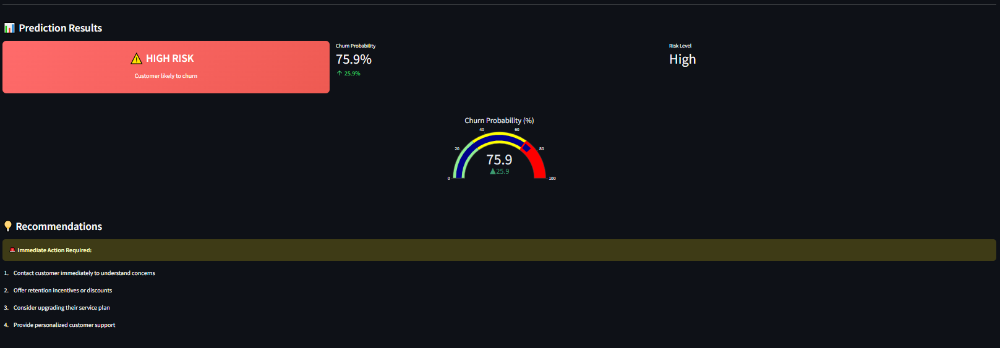

# Customer Churn Prediction System
Machine learning project to predict customer churn (Telco Customer Churn) using PostgreSQL/MongoDB as data sources, with exploratory analysis, preprocessing, model training, and dashboard.

## 🚀 Live Demo

**[Try the Live Application](https://customer-churn-prediction-030625.streamlit.app/)**

## 📊 Project Overview

This project analyzes customer data to predict whether a customer is likely to churn (leave the service). It uses machine learning algorithms to identify patterns in customer behavior and provides actionable insights for customer retention strategies.



## ✨ Features

- **Interactive Web Interface**: User-friendly Streamlit application for real-time predictions
- **Multiple Data Sources**: Support for PostgreSQL and MongoDB databases
- **Comprehensive Analysis**: Exploratory data analysis with visualizations
- **Machine Learning Models**: Trained models for accurate churn prediction
- **Data Processing Pipeline**: Automated data preprocessing and feature engineering
- **Model Explanations**: AI-powered explanations for prediction results



## 🛠️ Technology Stack

- **Frontend**: Streamlit
- **Backend**: Python
- **Databases**: PostgreSQL, MongoDB
- **Machine Learning**: Scikit-learn, Pandas, NumPy
- **Data Visualization**: Matplotlib, Seaborn, Plotly
- **Model Persistence**: Pickle

## 📁 Project Structure

```
customer-churn-prediction/
├── app/
│   ├── customer_churn_app_explanation.py    # AI explanations for predictions
│   └── streamlit_app.py                     # Main Streamlit application
├── data/
│   ├── processed/
│   │   └── telco_processed.csv             # Cleaned and processed data
│   └── raw/
│       └── WA_Fn-UseC_-Telco-Customer-C... # Original dataset
├── models/
│   ├── best_churn_model.pkl                # Trained ML model
│   ├── database_loaders_guide.md           # Database setup guide
│   └── model.ipynb                         # Model development notebook
├── notebooks/
│   ├── EDA_postgresql_mongodb.ipynb        # Database analysis
│   └── EDA.ipynb                          # Exploratory data analysis
└── scripts/
    ├── loaders/
    │   ├── mongodb_data_loader.py          # MongoDB data operations
    │   ├── postgresql_data_loader.py       # PostgreSQL data operations
    │   └── raw_data_loader.py             # Raw data processing
    └── preprocessor/
        ├── data_preprocessor_csv.py        # CSV data preprocessing
        ├── mongodb_data_preprocessor.py    # MongoDB preprocessing
        └── postgresql_data_preprocessing.py # PostgreSQL preprocessing
```

## 🚀 Getting Started

### Prerequisites

- Python 3.8+
- pip or conda package manager
- PostgreSQL (optional, for database features)
- MongoDB (optional, for database features)

### Installation

1. **Clone the repository**
   ```bash
   git clone https://github.com/AbhijeetDasBakshi/customer-churn-prediction.git
   cd customer-churn-prediction
   ```

2. **Create a virtual environment**
   ```bash
   python -m venv venv
   source venv/bin/activate  # On Windows: venv\Scripts\activate
   ```

3. **Install dependencies**
   ```bash
   pip install -r requirements.txt
   ```

4. **Set up databases (optional)**
   - Follow the guide in `models/database_loaders_guide.md` for PostgreSQL and MongoDB setup

### Running the Application

1. **Start the Streamlit app**
   ```bash
   streamlit run app/streamlit_app.py
   ```

2. **Access the application**
   - Open your browser and navigate to `http://localhost:8501`


## 📈 Usage

### Making Predictions

1. **Input Customer Data**: Enter customer information in the web interface
2. **Get Prediction**: Click predict to see churn probability
3. **View Explanation**: Review AI-generated explanations for the prediction
4. **Analyze Results**: Use insights for customer retention strategies

### Data Analysis

- **Exploratory Analysis**: Run `notebooks/EDA.ipynb` for comprehensive data insights
- **Database Analysis**: Use `notebooks/EDA_postgresql_mongodb.ipynb` for database-specific analysis




## 🤖 Model Information

The project uses a trained machine learning model (`best_churn_model.pkl`) that analyzes various customer features:

- **Customer Demographics**: Age, gender, partner status
- **Service Information**: Contract type, payment method, tenure
- **Usage Patterns**: Monthly charges, total charges, services used
- **Account Details**: Paperless billing, automatic payments



---



---




## 🔧 Development

### Adding New Features

1. **Data Processing**: Modify scripts in `scripts/preprocessor/`
2. **Model Training**: Update `models/model.ipynb`
3. **Web Interface**: Enhance `app/streamlit_app.py`

### Database Integration

The project supports multiple data sources:
- **CSV Files**: Direct file processing
- **PostgreSQL**: Relational database integration
- **MongoDB**: NoSQL database support


## 📊 Data Sources

The project uses telecommunications customer data from kaggle with features including:
- Customer account information
- Demographic details
- Service subscriptions
- Billing and payment data
- Usage statistics
  
[Data Source](https://www.kaggle.com/datasets/blastchar/telco-customer-churn/)

## 🤝 Contributing

1. Fork the repository
2. Create a feature branch (`git checkout -b feature/AmazingFeature`)
3. Commit your changes (`git commit -m 'Add some AmazingFeature'`)
4. Push to the branch (`git push origin feature/AmazingFeature`)
5. Open a Pull Request

## 📝 License

This project is licensed under the MIT License - see the [LICENSE](LICENSE) file for details.

## 🤝 Acknowledgments

- Dataset provided by Kaggle
- Streamlit for the amazing web framework
- Scikit-learn for machine learning capabilities

## 📞 Support

If you have any questions or issues, please:
1. Create a new issue if needed. Check the [Issues](https://github.com/AbhijeetDasBakshi/customer-churn-prediction/issues) page 
2. Contact: abhijeet.bakshi321@gmail.com

---

**⭐ If you found this project helpful, please give it a star!**
